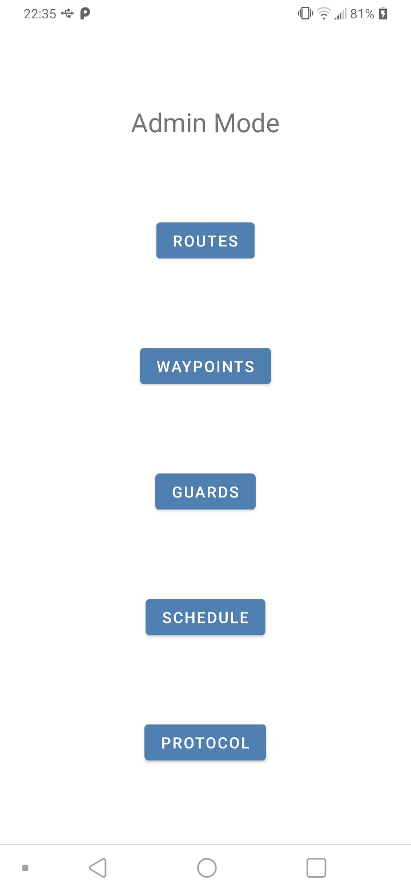
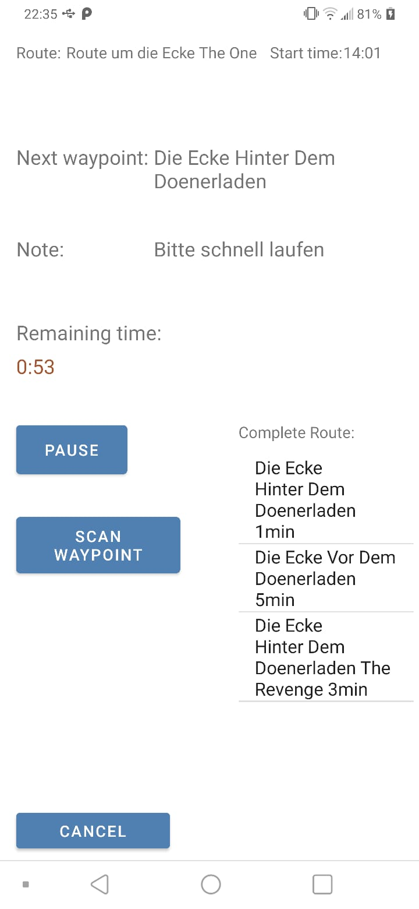

# App-Name Sopra Team 8

| Screenshot of  of the Admin Mode                                      | Screenshot of  of the Guard Mode                                      |
| ------                                                                | ------                                                                |
|   |   |

    
                                        

Mit dieser App kann man eigene Wachrundgänge erstellen, den Wärtern Routen zuweisen und die gemachten Routen überprüfen.

## Features

**TODO:** Additional Features

## Installation

1. Repository klonen: `git clone`
2. Android Studio Projekt öffnen
3. Android Studio Projekt bauen
4. Android Studio Projekt im Emulator ausführen oder APK erstellen lassen

## Verwendung der App

Um den Guarde Mode zu starten: Login mit Daten:  
    
*   Benutzername:   1 
*   Passwort:       1234

Um den Admin Mode zu starten: Login mit Daten:  
*   Benutzername:   admin
*   Passwort:       admin
                         

Zur Zeit muss eventuell mehrmals die Zurück-Taste betätigt werden um zum vorherigen Menü zu gelangen, da sich
nicht alle Activities automatisch schließen.
Dies wird jedoch in naher Zukunft geändert.

### Wichtiger Anwendungsfall 1

Routen können geplant werden, indem man verfügbare Wegpunkte sieht und diese 
untereinander verbinden kann mit der jeweils benötigten Zeit, um von A nach B
zu kommen.

### Wichtiger Anwendungsfall 2

Der Wächter bekommt Informationen darüber, welche Routen er wann ablaufen 
soll und kann seine geleistete Arbeit dokumentieren

## Changelog

Die Entwicklungsgeschichte befindet sich in [CHANGELOG.md](CHANGELOG.md).

## Verwendete Bibliotheken

Bisher keine.

## Lizenz

Genaue Bedingungen der Lizenz können in [LICENSE](LICENSE) nachgelesen werden.