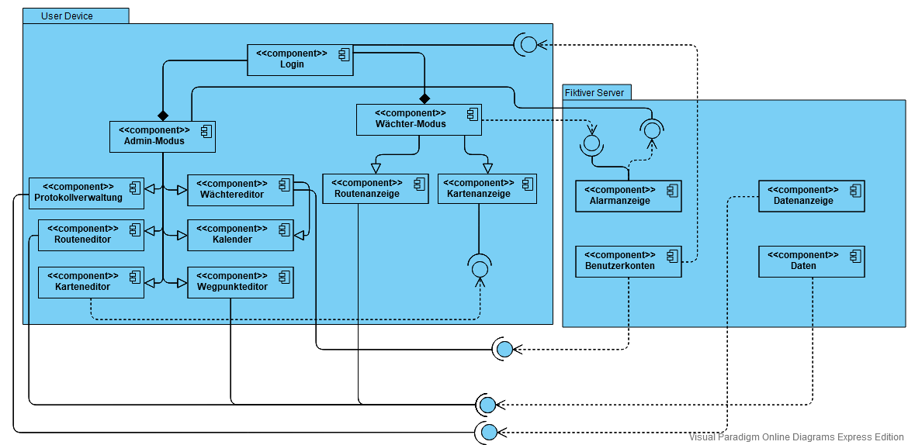

# Einführung

Die App besteht aus einem Admin-Modus sowie einem Wächter-Modus. Der Admin verwaltet die Profile, Wegpunkte, Routen, einen Kalender zur Organisation von Arbeitszeiten und ein Protokoll, in dem beendete Routen abgespeichert werden. 
Der Wächter-Modus ist für die Wachmänner gedacht, um ihre Routen abzuarbeiten. In diesem Modus kann man sich die ganze Route, den nächsten Wegpunkt sowie die restliche Zeit, um diesen zu erreichen, und eine Karte anzeigen lassen. 
Bei jedem Wegpunkt muss der Wächter einen Code eingeben und diesen mit Hilfe eines NFC-Tags abscannen, was im Protokoll vermerkt wird.

Verwendetes Entwurfsmuster: Top-Down (Epic->Feature->Implementable Story->Task)

## Komponentendiagramm

*Gubaer at the German language Wikipedia [GFDL](http://www.gnu.org/copyleft/fdl.html) or [CC-BY-SA-3.0](http://creativecommons.org/licenses/by-sa/3.0/), via Wikimedia Commons.*

**TODO:** Komponentendiagramm der eigenen und externen Komponenten der App erstellen.

# Komponente 1: Login

Die Login Komponente benötigt eine Schnittstelle von Benutzerkonten, um zwischen Wachmann und Admin zu unterscheiden. Dazu hat sie zwei Komponenten Wachmann-Modus und Admin-Modus, von der eine ausgeführt wird sobald jemand sich eingeloggt hat.

## Komponente 2: Admin Modus

Der Admin-Modus wird aktiviert, sobald sich ein Admin angemeldet hat. Der Admin-Modus erlaubt die unabhängige Erstellung von Routen und Wächterprofilen, wobei er diese beliebig bearbeiten und verbinden kann.
Routen können dabei auch ohne einen Wächter der sie ausführt erstellt werden und andersherum. Die Routen werden mit Hilfe von Wegpunkten
erstellt, die der Admin einzeln initialisieren muss. Als Additional Feature kann er sie auf einem hochgeladenen Bild oder einer Karte des Gebiets
einordnen, um dem Wächter visuelle Unterstützung zu geben.
Der Admin kann sich ein Protokoll anzeigen lassen, in dem abgelaufene Routen verzeichnet werden (mit Soll-Zeit und tatsächlicher Zeit) und
kann einzelne löschen, jedoch keine Bearbeitung der Zeiten vornehmen, wodurch Manipulation vorgebeugt wird. Die Routen, Wegpunkte sowie Wächterprofile werden
in csv-Dateien gespeichert, wobei sie verschlüsselt sind.

## Komponente 3: Wächter Modus 

Der Wächter-Modus wird aktiviert, sobald sich ein Wächter angemeldet hat.
Die Wachmänner nutzen ihn um auf ihrer App die nächsten Wegpunkte anzeigen zu lassen.
Dabei läuft ein Countdown ab, der anzeigt, wie viel Zeit ihnen noch bleibt um zum nächsten Wegpunkt zu kommen. Sobald ein Wachmann einen Wegpunkt erreicht hat,
muss er einen NFC Tag abscannen, bei dem sein Passwort abgefragt wird. Um den Überblick zu behalten, kann er sich, durch die Routenanzeigen Komponente, eine Routenübersicht anschauen
und auf seinen Standort zugreifen, der über die Kartenanzeige Komponente visualisiert wird. Falls der Wachmann sein Passwort drei Mal falsch eingibt, der Countdown abgelaufen ist, oder ein Wegpunkt übersprungen wurde
wird der stille Alarm aktiviert, der durch ein Textfenster visuell unterstützt wird. Dazu stellt er eine Schnittstelle zur Alarmanzeige bereit.

## Komponente 4: Routenanzeige

Sie benötigt eine Schnittstelle von den Daten um die Routen aufrufen zu können. Der Wachmann kann mit diesen Daten eine Route in Form einer Tabelle anzeigen lassen.

## Komponente 5: Kartenanzeige

Die Kartenanzeige benötigt eine Schnittstelle vom Karteneditor, damit die Karte die vom Admin eingefügt wird auch vom Wachmann geöffnet werden kann.

## Komponente 6: Alarmanzeige

Die Alarmanzeige benötigt eine Schnittstelle vom Wächter-Modus, da dieser den Alarm auslöst. Sie gibt diesen dann an den Admin weiter, für den eine Schnittstelle bereit gestellt wird.

## Komponente 7: Datenanzeige

Über den Fiktiven Server kann der Admin sich die Routen mit Zeitdifferenz, Alarmort und Pausenzeit einsehen, dazu wird eine Schnittstelle für die Protokollverwaltung hinzugefügt.

## Komponente 8: Daten

Alle wichtigen Informationen werden in csv-Dateien gespeichert, diese werden vom Wegpunkteditor, Routeneditor und Routenanzeige genutzt, Dazu wird eine Schnittstelle bereit gestellt.

## Komponente 9: Benutzerkonten

Alle Wachmänner und Admins werden hier gespeichert, diese können durch eine Schnittstelle in der Wächtereditor Komponente verändert werden. Damit sich auch nur die Admins/Wächter anmelden können wird auch dafür eine Schnittstelle bereit gestellt.

## Komponente 10: Protokollverwaltung

Der Admin kann hier alle gemachten Routen in einer Tabelle einsehen
Benötigt Schnittstelle von: Daten, um logEntrys anzeigen zu können und abzuspeichern

## Komponente 11: Routeneditor

Der Admin kann neue Routen erstellen sowie bereits bestehende Routen bearbeiten
Benötigt Schnittstelle von: Daten, um auf Routenobjekte zugreifen zu können

## Komponente 12: Wächtereditor

Der Admin kann neue Wächter erstellen sowie bereits bestehende Wächter bearbeiten
Benötigt Schnittstelle von: Daten, um auf Wächterobjekte zugreifen zu können

## Komponente 13: Kalender

Der Admin kann Routen und Wächter miteinander verknüpfen und bei Wochentagen sowie Uhrzeiten eintragen

## Komponente 14: Karteneditor

Der Admin kann hier eine Karte erstellen sowie Wegpunkt-Objekte darauf lokalisieren
Liefert Schnittstelle für: Kartenanzeige, da die Karte von der Anzeige aufgerufen wird

## Komponente 15: Wegpunkteditor

Der Admin kann neue Wegpunkte erstellen sowie bereits bestehende Wegpunkte bearbeiten
Benötigt Schnittstelle von: Daten, um auf Wegpunkt-Objekte zugreifen zu können

# Klassendiagramm

*Gubaer at the German language Wikipedia [GFDL](http://www.gnu.org/copyleft/fdl.html) or [CC-BY-SA-3.0](http://creativecommons.org/licenses/by-sa/3.0/), via Wikimedia Commons*

**TODO:** Klassendiagramm der Aufteilung der eigenen Komponenten in Klassen darstellen.

## Beschreibung der wichtigen Klassenhierarchie 1

**TODO:** Die wichtigen Klassen und ihre Hierarchie beschreiben.

## Beschreibung der wichtigen Klasse 2

## Beschreibung der wichtigen Klasse 3

# GUI-Skizze

GUI-Skizze von Jan-Peter Ostberg, CC-BY-SA 4.0

**TODO:** Eigene möglichst handschriftliche GUI-Skizzen erstellen und beschreiben.